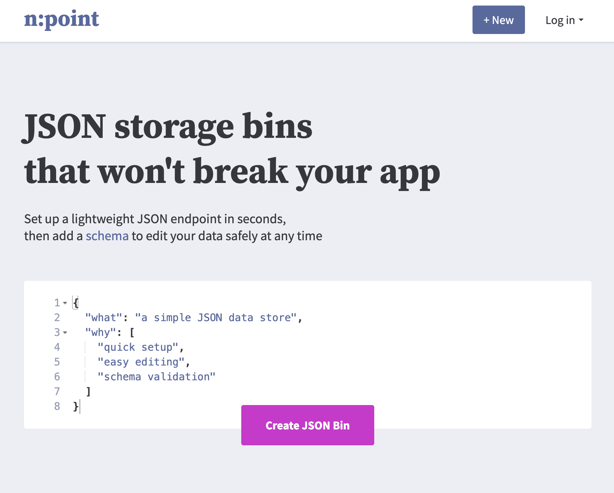
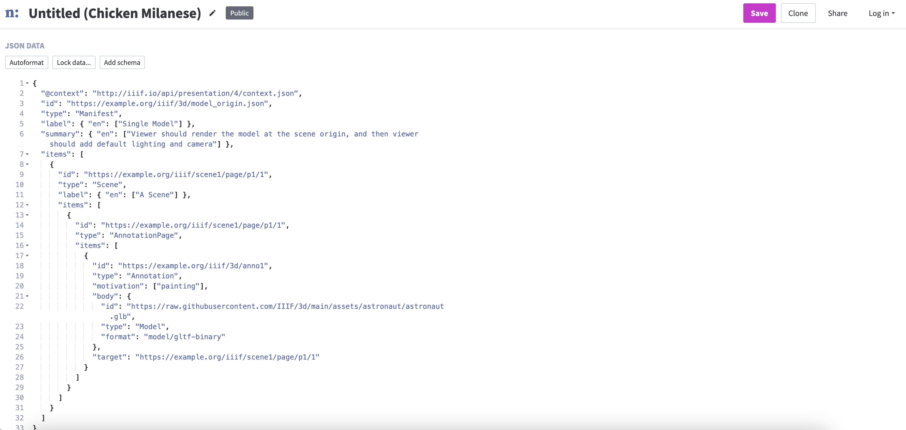
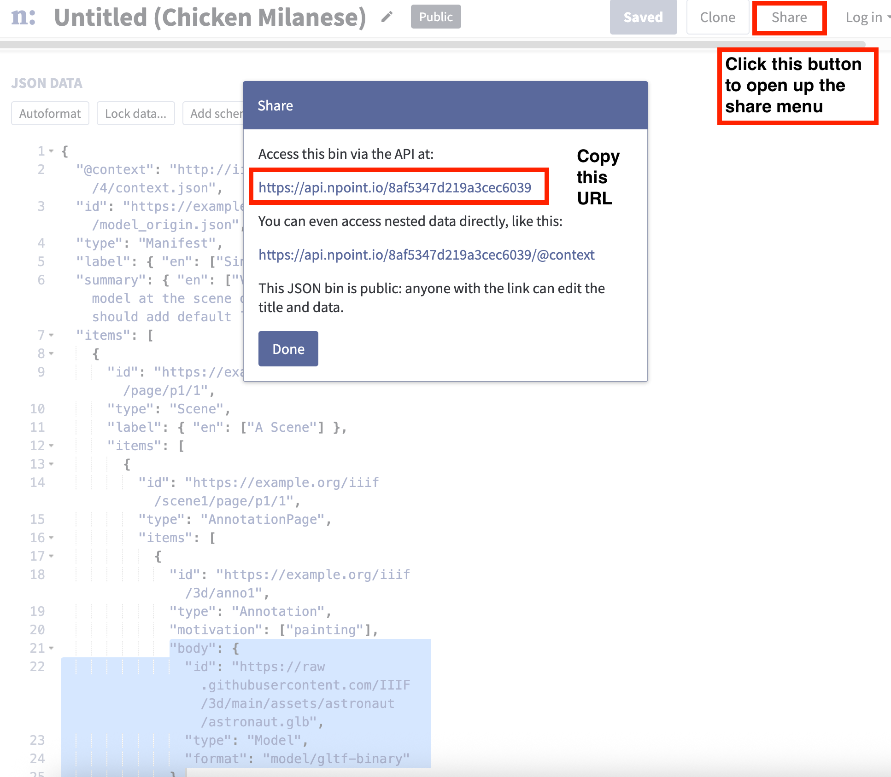

<style>
  .img-style {
    width: 70%;
    display: block;
    margin: 1rem auto;
    max-width: 100%;
    height: auto;
    box-shadow: 0 12px 28px rgba(0,0,0,.18), 0 2px 8px rgba(0,0,0,.12);
    border-radius: 8px;
  }
</style>

# Create a basic 3D manifest 

This short guide will give you step by step instructions for creating a basic 3D manifest using a 3D model from Sketchfab. For this example I am going to use the [3D IIIF logo](https://skfb.ly/6SWEH):

<div class="sketchfab-embed-wrapper"> <iframe title="IIIF Logo" frameborder="0" allowfullscreen mozallowfullscreen="true" webkitallowfullscreen="true" allow="autoplay; fullscreen; xr-spatial-tracking" xr-spatial-tracking execution-while-out-of-viewport execution-while-not-rendered web-share src="https://sketchfab.com/models/5202e71e7b814fdb988a2b4cc070c370/embed"> </iframe> <p style="font-size: 13px; font-weight: normal; margin: 5px; color: #4A4A4A;"> <a href="https://sketchfab.com/3d-models/iiif-logo-5202e71e7b814fdb988a2b4cc070c370?utm_medium=embed&utm_campaign=share-popup&utm_content=5202e71e7b814fdb988a2b4cc070c370" target="_blank" rel="nofollow" style="font-weight: bold; color: #1CAAD9;"> IIIF Logo </a> by <a href="https://sketchfab.com/nebulousflynn?utm_medium=embed&utm_campaign=share-popup&utm_content=5202e71e7b814fdb988a2b4cc070c370" target="_blank" rel="nofollow" style="font-weight: bold; color: #1CAAD9;"> Thomas Flynn </a> on <a href="https://sketchfab.com?utm_medium=embed&utm_campaign=share-popup&utm_content=5202e71e7b814fdb988a2b4cc070c370" target="_blank" rel="nofollow" style="font-weight: bold; color: #1CAAD9;">Sketchfab</a></p></div>

## Step 1: Download and publish 3D model

The first step is to download the 3d model as a glb file. Click the download 3d model link:

{: .img-style }

Select the smallest GLB file and click Download:

{: .img-style }

Now upload the file to Ronald's web space....

## Step 2: Create a basic Manifest

The next step is to take the Example manifest and copy it to a place which you can edit:

[https://iiif.github.io/3d/manifests/1_basic_model_in_scene/README.html](https://iiif.github.io/3d/manifests/1_basic_model_in_scene/README.html)

Download the model_origin.json file by right clicking and selecting save link as:

{: .img-style}

We now need to edit the Manifest to change the location of the 3d model we would like to view. To do this we are going to use a service called npoint.io which allows editing and publishing of JSON files. Open up the following page:

[https://www.npoint.io/](https://www.npoint.io/)

Then select +New or Create JSON Bin. Note there is no need to login or create a user. 

{: .img-style}

Now we need to copy the JSON from the Manifest into npoint.io. If you open up the Manifest you downloaded in Notepad or another text editor and paste the content into npoint.io:

{: .img-style}

Now we need to replace the URL to the model which looks like this in the example manifest:

```
"body": {
    "id": "https://raw.githubusercontent.com/IIIF/3d/main/assets/astronaut/astronaut.glb",
    "type": "Model",
    "format": "model/gltf-binary"
},
```

Replace the id URL with the URL to your Model. Now click the Save button. We now need to get the URL to the Manifest. To do this click the share button to open up the share dialog. Then copy the URL highlighted in the image below:




## Step 3: View your manifest in one of the IIIF Viewers

Now we have the URL to the manifest we can supply this to a number of IIIF viewers to see the same content presented differently in each of the viewers. To make this a bit easier there is a text box below which you can paste the Manifest URL and select a viewer to open it. 

<div class="row">
    <label for="text">Manifest URL:</label>
    <input id="text" type="text" size="100" placeholder="e.g. https://api.npoint.io/8af5347d219a3cec6039" />
  </div>

  <div class="row" style="margin-top:.75rem;">
    <label for="dest">IIIF Viewer</label>
    <select id="dest">
      <!-- Append as query: ?q=TEXT -->
      <option value="https://www.morphosource.org/uv/uv.html#" data-mode="append" data-param="manifest">
         MorphoSource
      </option>
      <!-- Append as path: /wiki/TEXT -->
      <option value="https://smithsonian.github.io/voyager-dev/iiif/iiif_demo" data-mode="append" data-param="document">
        Voyager
      </option>
      <!-- Another path example: /users/TEXT -->
      <option value="https://uv-v4.netlify.app/#"  data-mode="append" data-param="manifest">
        Universal Viewer 
      </option>
      <option value="https://spri-open-resources.s3.us-east-2.amazonaws.com/iiif3dtsg/manifest/index.html#" data-mode="append" data-param="manifest">
        X3DOM Viewer
      </option>
     <!-- <option value="https://blacklodge.hki.uni-koeln.de/viewer/?locale=en&standalone=true"  data-mode="query" data-param="manifest">
        Kompakkt Viewer
      </option>-->
    </select>

    <button id="go" type="button">Open</button>
  </div>

  <script>
    const $ = (id) => document.getElementById(id);

    $("go").addEventListener("click", () => {
      const input = $("text").value.trim();
      const sel   = $("dest");
      const base  = sel.value;
      const mode  = sel.options[sel.selectedIndex].dataset.mode;
      const param = sel.options[sel.selectedIndex].dataset.param;

      // Build the final URL
      let urlStr;
      try {
        if (mode === "append") {
            urlStr = base + "?" + param + "=" + input;
        } else {
            const u = new URL(base, window.location.href); // supports absolute or relative base
            // Query mode (e.g., ?q=TEXT). If input empty, we still open base.
            if (input) {
                u.searchParams.set(param, input);
            }

            urlStr = u.toString();
        }

      } catch (e) {
        // Fallback if base isn't a valid URL for some reason
        urlStr = base + encodeURIComponent(input);
      }

      // Open in a new tab/window safely
      window.open(urlStr, "_blank", "noopener,noreferrer");
    });
  </script>