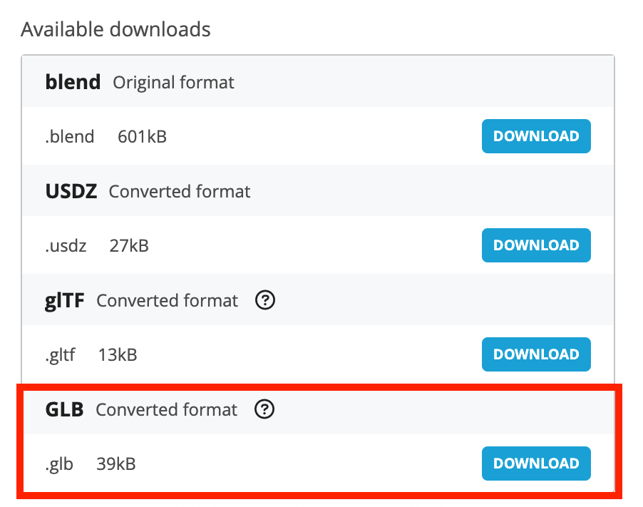

# Create a basic 3D manifest 

This short guide will give you step by step instructions for creating a basic 3D manifest using a 3D model from Sketchfab. For this example I am going to use the [3D IIIF logo](https://skfb.ly/6SWEH):

 <iframe title="IIIF Logo" frameborder="0" allowfullscreen mozallowfullscreen="true" webkitallowfullscreen="true" allow="autoplay; fullscreen; xr-spatial-tracking" xr-spatial-tracking execution-while-out-of-viewport execution-while-not-rendered web-share src="https://sketchfab.com/models/5202e71e7b814fdb988a2b4cc070c370/embed"> </iframe> 
 <a href="https://sketchfab.com/3d-models/iiif-logo-5202e71e7b814fdb988a2b4cc070c370?utm_medium=embed&utm_campaign=share-popup&utm_content=5202e71e7b814fdb988a2b4cc070c370" target="_blank" rel="nofollow" style="font-weight: bold; color: #1CAAD9;"> IIIF Logo </a> by <a href="https://sketchfab.com/nebulousflynn?utm_medium=embed&utm_campaign=share-popup&utm_content=5202e71e7b814fdb988a2b4cc070c370" target="_blank" rel="nofollow" style="font-weight: bold; color: #1CAAD9;"> Thomas Flynn </a> on <a href="https://sketchfab.com?utm_medium=embed&utm_campaign=share-popup&utm_content=5202e71e7b814fdb988a2b4cc070c370" target="_blank" rel="nofollow" style="font-weight: bold; color: #1CAAD9;">Sketchfab</a>

## Step 1: Download and publish 3D model

The first step is to download the 3d model as a glb file. Click the download 3d model link:

Select the smallest GLB file and click Download:

Now upload the file to Ronald's web space....

## Step 2: Create a basic Manifest

The next step is to take the Example manifest and copy it to a place which you can edit:

https://iiif.github.io/3d/manifests/1_basic_model_in_scene/README.html

Download the model_orgin.json file by right clicking and selecting save link as:

