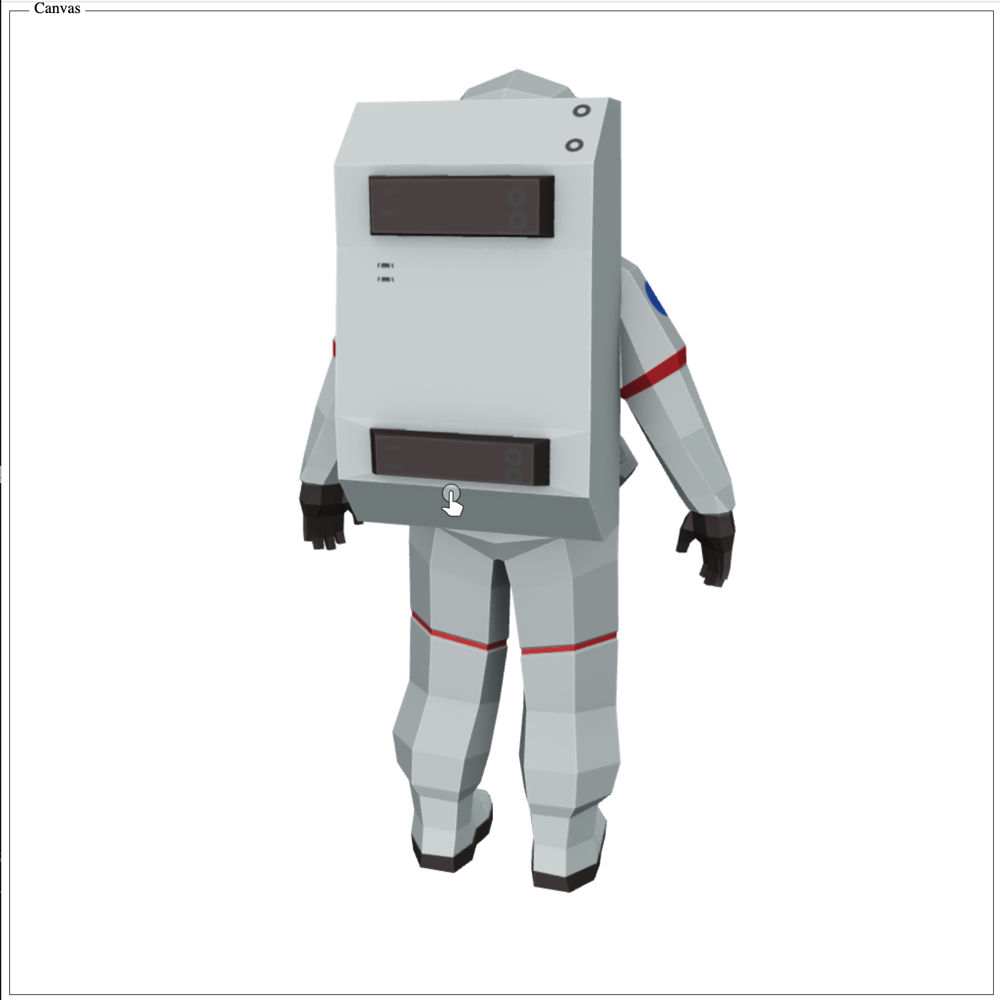
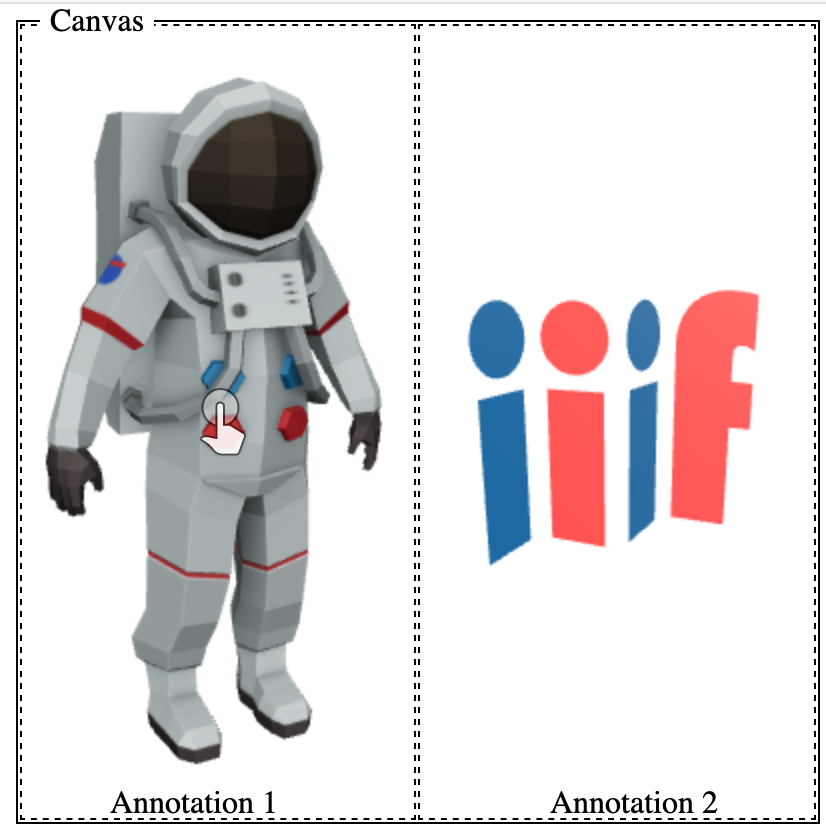
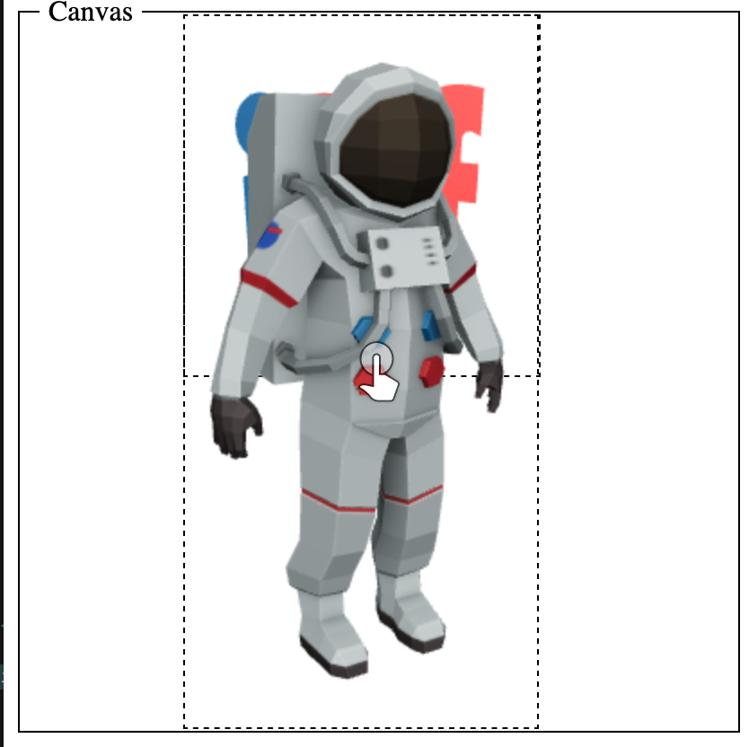

# 2D First Approach
[Back to 3D Prototyping](../)

This was first suggested on the call on the 9th of March 2021. The approach here is to leave the canvas with three dimensions and treat the 3d object as a discreet object which can be painted on to the canvas. The canvas would look as follows:

[manifest.json](manifest.json)
```
{
  "id": "https://glenrobson.github.io/iiif_stuff/3d_prototypes/scene/1",
  "type": "Canvas",
  "height": 1000,
  "width": 1000,
  "items": [
    {
      "id": "https://glenrobson.github.io/iiif_stuff/3d_prototypes/annotations",
      "type": "AnnotationPage",
      "items": [
        {
          "id": "https://glenrobson.github.io/iiif_stuff/3d_prototypes/annotations/1",
          "type": "Annotation",
          "motivation": "painting",
          "body": {
            "id": "https://modelviewer.dev/shared-assets/models/Astronaut.glb",
            "type": "Dataset",
            "format": "model/gltf-binary"
          },
          "target": "https://glenrobson.github.io/iiif_stuff/3d_prototypes/scene/1"
        }
      ]
    }
  ]
}
```

In this example the 3d model is painted onto the canvas and fills the full width and height of the canvas. The canvas dimensions are arbitrary in this example but are required by IIIF and useful in the further examples below.  

## I want to show a 3d model in a IIIF viewer

This type of manifest could be shown in a viewer like the following demo: 

<a href="Astronaut.html">
    <span style="display: block; margin-left: auto; margin-right: auto;">Astronaut.html</span>
    
</a>

and would solve the first use case of allowing a IIIF viewer to show a 3d model. 

## Models from different repositories in a single space

It could in a way handle brining together two models from different locations. This could be achieved in a similar way to how IIIF can draw images from different repositories. In the following example the canvas has two annotations one for each model. The first model (annotation 1) is the Astronaut model shown earlier and the second model (annotation 2) is stored locally but is downloaded from [SketchFab](https://skfb.ly/6SWEH). The difficulty is where to target or place the two models on the canvas. The example below draws the two models side by side on the canvas. See the [example manifest](side_by_side.json) and the demo below:

<a href="side_by_side.html">
    <span style="display: block; margin-left: auto; margin-right: auto;">side_by_side.html</span>
    
</a>

Drawing two 3d models on to a 2d canvas has a number of issues. Because the 3d models are separate containers its not possible to put the IIIF model in the Astronaut model which means you couldn't handle the reconstructing Vase use case or the room reconstruction use case. Both of the models are also controlled independently and so you can't spin round to see the back of the composition. A demonstration of how this would look is below. In this example the IIIF model has been placed behind the Astronaut and to give the illusion of depth it has been made smaller. As they are both separate models the are controlled separately so spin independently.

<a href="iiif_behind.html">
    <span style="display: block; margin-left: auto; margin-right: auto;">iiif_behind.html</span>
    
</a>

There is also the issue on what to do with the 3rd IIIF dimension time. It would be possible to move the two models around the canvas over time but it suffers the same issue in that the behaviour when they overlap is less than desirable. IIIF doesn't have a concept of a z-index but if things are overlapping it is the order of the annotations which is taken as the depth order.


## Place two different models into a single space

Partly possible in that you can place two different models in the same 2d space. Doesn't cover the intent of the [use case](https://github.com/IIIF/iiif-3d-stories/issues/6).

## Save and share camera positions

Presumably the camera position is set in the GlTF files. If you change the camera position or more specifically in these viewers rotate or zoom in on the model the [Content State](https://iiif.io/api/content-state/0.3/) standard could be extended to record the rotation and zoom of the model. 

## Defining Initial View Position

Presumably this is also set in the GlTF file. 

## Support Annotation

It could be possible to do 2d annotations and record the rotation and zoom of the model. The annotations would break if the GlTF file was changed for example if the camera was moved. By losing the abstraction of the conversion between units in a canvas and the GlTF file you loose some of the safety in targeting annotations on a canvas. If the GlTF file contained annotations presumably these would be in z,y,z coordinates. 

## Consistent Unit Scale

The only way this is controlled is by the annotation target. If the second model was smaller than the first model then the second model can be painted on to a smaller area of the canvas. Unless GlTF supports the conversion of pixels to meters then it won't be possible to do measurements. 

