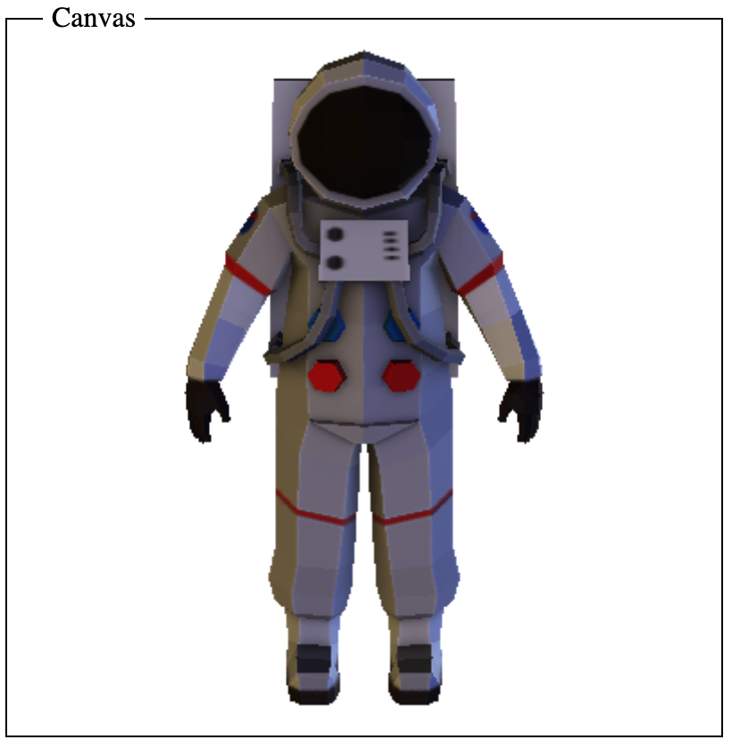
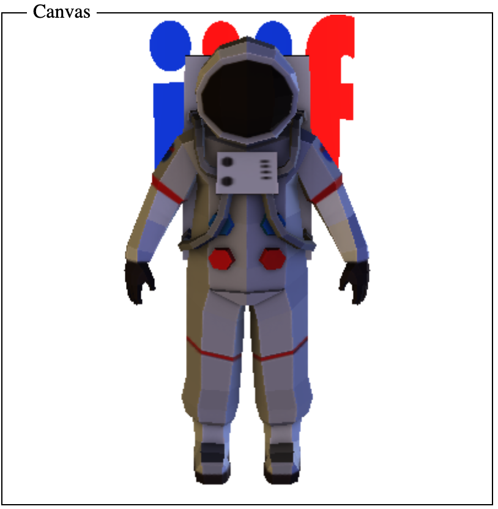

# 3D First Approach
[Back to 3D Prototyping](../)

This was first suggested on the call on the 16th of February 2021. The approach here is to leave extend the IIIF canvas with another dimension for depth. Once the canvas has been extended it is possible to paint 3d models into the canvas/scene. **Note this is just an example to provoke discussion and if 3d is included in the IIIF specs in future it may look very different.**

The canvas could look as follows:

[manifest.json](manifest.json)
```
{
  "id": "https://glenrobson.github.io/iiif_stuff/3d_prototypes/3d_first/scene/1",
  "type": "Canvas",
  "height": 1000,
  "width": 1000,
  "depth": 1000,
  "items": [
    {
      "id": "https://glenrobson.github.io/iiif_stuff/3d_prototypes/3d_first/annotations",
      "type": "AnnotationPage",
      "items": [
        {
          "id": "https://glenrobson.github.io/iiif_stuff/3d_prototypes/3d_first/annotations/1",
          "type": "Annotation",
          "motivation": "painting",
          "body": {
            "id": "https://modelviewer.dev/shared-assets/models/Astronaut.glb",
            "type": "Dataset",
            "format": "model/gltf-binary",
            "height": 500, 
            "width": 500,
            "depth": 500 
          },
          "target": "https://glenrobson.github.io/iiif_stuff/3d_prototypes/3d_first/scene/1"
        }
      ]
    }
  ]
}
```
Open Questions:
 * Cameras and light sources are they annotations? 
 * How does scale work? Does gltf have a shared concept of scale? The conversion from annotation body to canvas sizes can do some scaling but it would be useful to know if size is consistent in gltf files.
 * Might have to rotate the model both in the x but also y dimension. 

## I want to show a 3d model in a IIIF viewer

This would be possible as seen in the example below. The lighting and camera could be set as sensible defaults as seen in the modelviewer application or potentially could be set in the canvas as annotations. 

<a href="Astronaut.html">
    <span style="display: block; margin-left: auto; margin-right: auto;">Astronaut.html</span>
    
</a>

## Models from different repositories in a single space

This looks like it works in the following example below. One model comes from a remote location (https://modelviewer.dev/shared-assets/models/Astronaut.glb) and the second model is hosted locally but comes from [SketchFab](https://skfb.ly/6SWEH).

<a href="iiif_behind.html">
    <span style="display: block; margin-left: auto; margin-right: auto;">iiif_behind.html</span>
    
</a>

In the [manifest](behind_iiif.json) two models are annotated on to the one canvas. The Astronaut is painted full size at position x=0, y=-1 (vertical axis), z=0 and is full size. This is mocked up using the following invalid [media-frags](https://www.w3.org/TR/media-frags/) URL:

```
https://glenrobson.github.io/iiif_stuff/3d_prototypes/3d_first/scene/1?xyzwhd=0,-1,0,500,500,500
```

The IIIF logo model is printed at position x = 0, y = 0, z = -5 (5 away from the camera) and is scaled to be half the size of the original. This is done by setting the width, height and depth as 500,500,500 in the annotation and then adding smaller sizes in the target of 250,250,250:

```
"target": "https://glenrobson.github.io/iiif_stuff/3d_prototypes/3d_first/scene/1?xyzwhd=0,0,-5,250,250,250"
```

Currently the camera and lighting is hard coded into the demo webpage but it might be more useful to have these as annotations in the manifest. Are these things usefully encoded in the gltf files or would you need seperate ones anyway if you are combining models?


## Place two different models into a single space

As the demo above proves this is possible. Questions:

 * Are there scalability issues? 
 * Would you need to limit the number or size of the models? 
 * Can we use some of the tiling options for 3d?
 * Do we limit the type of models that can be painted? Only Point clouds?

## Save and share camera positions

If the camera was setup as an annotation then this could be shared using an extension to [Content State](https://iiif.io/api/content-state/0.3/).

## Defining Initial View Position

Related to the above but if the camera was an annotation then it could be set in the manifest along with the position and size of the models. 

## Support Annotation

As the canvas would now have 3 dimensions plus time it would be possible to do a x,y,z annotation. There would have to be some development of either [media-frags](https://www.w3.org/TR/media-frags/) or custom selectors to be able to support the extra parameters.  

## Consistent Unit Scale

By converting the annotation body dimensions to the canvas dimensions you can do scaling. More investigation is required to see if the size units in gtlf and other formats are interoperable otherwise clients or the JSON may need to help be setting the scale of the source model. 

Also issue on whether a bounding cube is acceptable to the IIIF 3d community. There may be ways to do the scaling with unbounded axis but some sort of scale would have to be thought about. 
