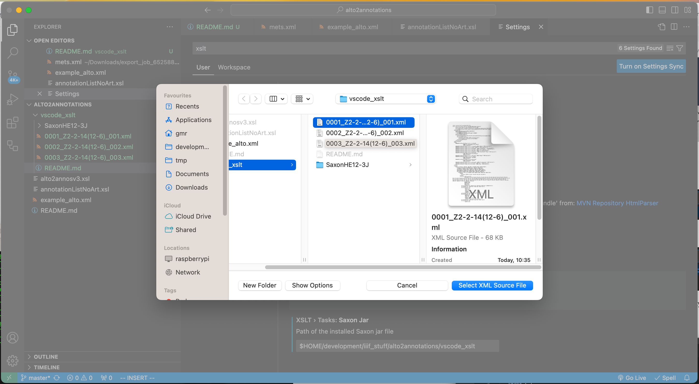

# Running XSLTs with VS Code

Download the XSLT plugin:

https://marketplace.visualstudio.com/items?itemName=deltaxml.xslt-xpath

Install Java:
https://code.visualstudio.com/docs/languages/java

Download Saxon:
https://www.saxonica.com/download/java.xml
Saxon-HE

Setup saxon in settings. Go to VS Code settings and add path to saxon:

Now run the XSLT task to convert the XML to JSON annotations. This takes a number of steps:

## Step 1: open the command dialog at the top of the screen and select run task

## Step 2: Select the XSLT task

## Step 3: Select the Saxon transformer

## Step 4: Select the annotationListNoArt.xsl

## Step 5: Select the ALTO xml

Results will be in xsl-out/result1.xml This will need to be renamed to .json.
