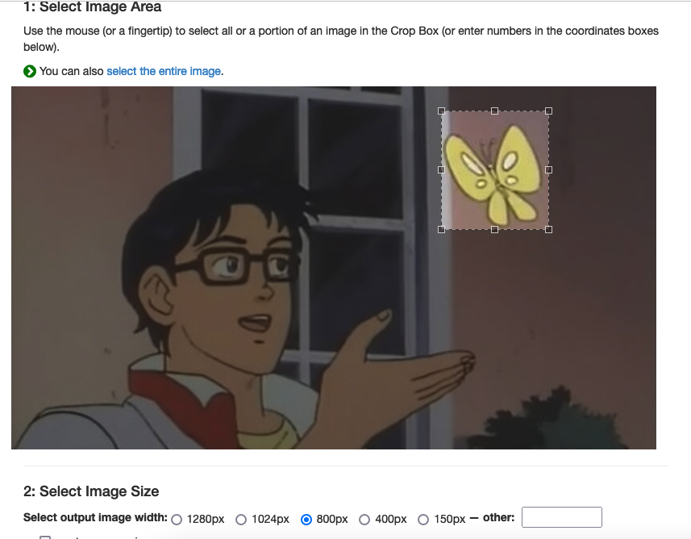
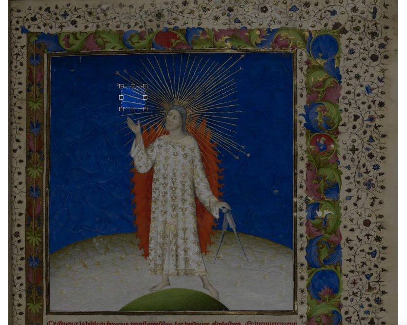
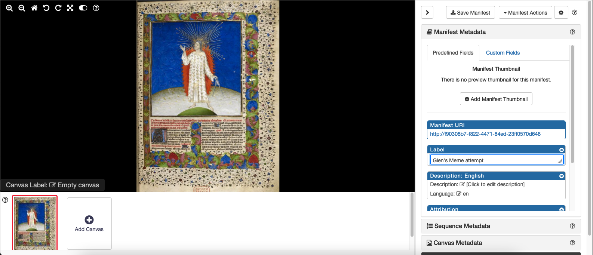

# Meme Challenge

<script type='text/javascript' src='https://unpkg.com/mirador@latest/dist/mirador.min.js'></script>

So Josh has set me a challenge to look at this tweet:

<blockquote class="twitter-tweet"><p lang="en" dir="ltr">ahem! I am WAITING 😤 for someone to make a manifest that uses layers to stitch a butterfly onto this 🦋 <a href="https://t.co/CBbJZ90xWz">https://t.co/CBbJZ90xWz</a></p>&mdash; Camille Villa (@effusivelynerdy) <a href="https://twitter.com/effusivelynerdy/status/1534722776111534083?ref_src=twsrc%5Etfw">June 9, 2022</a></blockquote> <script async src="https://platform.twitter.com/widgets.js" charset="utf-8"></script> 

Luckily [Philip Allfrey](https://twitter.com/dr_pda) has already done it in the replies but Josh wanted me to have a look to see if there is an easier way... 

## Table of Contents
 * [Step 1 - Finding the images](#step-1---finding-the-images)
 * [Step 2 - Catching the butterfly](#step-2---catching-the-butterfly)
 * [Step 3 - Finding the region to paint the Butterfly](#step-3---finding-the-region-to-paint-the-butterfly)
 * [Step 4 - Creating the Manifest](step-4---creating-the-manifest)
   * [Attempt 1 - Fail!](#attempt-1---fail)
   * [Attempt 2 - Fail!](#attempt-2---fail)
   * [Attempt 3 - Success!](#attempt-3---success)
   * [Attempt 4 - Fail!](#attempt-4---fail)
 * [Step 5 - Publishing the manifest](#stage-5---publishing-the-manifest)

## Step 1 - Finding the images

As Philip found the original [British Library Manuscript](http://www.bl.uk/manuscripts/Viewer.aspx?ref=royal_ms_19_d_iii_f003r) isn't available yet as IIIF. It looks like there are versions available on [Flickr](https://www.flickr.com/photos/britishlibrary/12459179443) which has been copied to [Wikipedia](https://commons.wikimedia.org/wiki/File:The_Creation_-_Bible_Historiale_(c.1411),_vol.1,_f.3_-_BL_Royal_MS_19_D_III.jpg) and also the one in [Stanford](https://stacks.stanford.edu/image/iiif/ff139pd0160%252FK90113-43/full/full/0/default.jpg) that Philip found.

The Stanford version has been slightly cropped so I'm going to use the Wikipedia version. Wikipedia has an undocumented IIIF image server and details on how to access this image can be found on the [IIIF Guides site](https://guides.iiif.io/guides/wikipedia.org/). The URL to the info.json for this item looks like:

https://tools.wmflabs.org/zoomviewer/proxy.php?iiif=The_Creation_-_Bible_Historiale_(c.1411),_vol.1,_f.3_-_BL_Royal_MS_19_D_III.jpg/info.json

The second meme image is also not available as IIIF. There is a version here from [knowyourmeme.com](https://knowyourmeme.com/memes/is-this-a-pigeon):

[https://pbs.twimg.com/media/FUrdyRxX0AkHU1O?format=png&name=small](https://pbs.twimg.com/media/FUrdyRxX0AkHU1O?format=png&name=small)

but notice the orientation is different in this image to the one in the tweet. In the tweet the butterfly is on the left but in the one above the butterfly is on the right. 

## Step 2 - Catching the butterfly

Now we have our images the first thing to do is to find the coordinates of the butterfly. To do this I am going to turn the Meme into a IIIF image using [iiifhosting.com](https://iiifhosting.com) which offers 5 free images. This produces this image:

[https://free.iiifhosting.com/iiif/911b5db417254ff6a08ac79a80a97a45f04fdc6dd9424d48170e57150c8e2b11/](https://jbhoward-dublin.github.io/IIIF-imageManipulation/index.html?imageID=https://free.iiifhosting.com/iiif/911b5db417254ff6a08ac79a80a97a45f04fdc6dd9424d48170e57150c8e2b11)

Next we want to find the region of the butterfly and we can do this using the UCD IIIF image tool:

[https://jbhoward-dublin.github.io/IIIF-imageManipulation/index.html?imageID=https://free.iiifhosting.com/iiif/911b5db417254ff6a08ac79a80a97a45f04fdc6dd9424d48170e57150c8e2b11](https://jbhoward-dublin.github.io/IIIF-imageManipulation/index.html?imageID=https://free.iiifhosting.com/iiif/911b5db417254ff6a08ac79a80a97a45f04fdc6dd9424d48170e57150c8e2b11)

You can use the region editor to find the region:



Then scroll down and it will tell you the IIIF URL:

<a href="https://free.iiifhosting.com/iiif/911b5db417254ff6a08ac79a80a97a45f04fdc6dd9424d48170e57150c8e2b11/534,31,132,146/132,/!0/default.jpg"></a>

I've altered the size so it doesn't make the butterfly bigger than the source image. This is possible because the region is given as x,y,width,height and in this example you can see the width is 132 pixels so the size parameter (`132,`) shouldn't be bigger then 132. Also note the rotation is set to `!0` so that it appears mirrored as in the first tweet. 

## Step 3 - Finding the region to paint the Butterfly

We need to find the coordinates that we want to paint our butterfly on to the BL image. To do this we can again use the UCD region tool:

[https://jbhoward-dublin.github.io/IIIF-imageManipulation/index.html?imageID=https://tools.wmflabs.org/zoomviewer/proxy.php?iiif=The_Creation_-_Bible_Historiale_(c.1411),_vol.1,_f.3_-_BL_Royal_MS_19_D_III.jpg](https://jbhoward-dublin.github.io/IIIF-imageManipulation/index.html?imageID=https://tools.wmflabs.org/zoomviewer/proxy.php?iiif=The_Creation_-_Bible_Historiale_(c.1411),_vol.1,_f.3_-_BL_Royal_MS_19_D_III.jpg)

Once we have chosen our region:



we can again get the IIIF URL:

[https://tools.wmflabs.org/zoomviewer/proxy.php?iiif=The_Creation_-_Bible_Historiale_(c.1411),_vol.1,_f.3_-_BL_Royal_MS_19_D_III.jpg/311,248,64,61/800,/0/default.jpg](https://tools.wmflabs.org/zoomviewer/proxy.php?iiif=The_Creation_-_Bible_Historiale_(c.1411),_vol.1,_f.3_-_BL_Royal_MS_19_D_III.jpg/311,248,64,61/800,/0/default.jpg)

and look at the region part of the URL (`/311,248,64,61/`) and this will gives the coordinates to paint our butterfly on the canvas. 

## Step 4 - Creating the Manifest

As Philip [mentions](https://twitter.com/dr_pda/status/1537953299273760768?s=20&t=qH1uRGNutGQYbwDJ1yrpzQ) the Bodleian Manifest editor doesn't support multiple images or layers but we can still use it to create a Basic Manifest using a single image which is the one from the British Library. 



Now we have our basic manifest we need to add in the second image. We will have to do this by directly editing the JSON for the canvas. As with most IIIF related Manifests it is always easier to copy what some else has done and the best example for painting multiple images on to a canvas is the example from the [Biblissima project](https://demos.biblissima.fr/chateauroux/demo/). They are painting a background image of a manuscript page and then painting the illustrations on top. The JSON for one of their canvases is below:

```
{
    "@id": "https://bvmm.irht.cnrs.fr/iiif/4490/canvas/canvas-981406",
    "@type": "sc:Canvas",
    "label": "f. 045v - 046",
    "height": 5412,
    "width": 7216,
    "images": [
        {
            "@type": "oa:Annotation",
            "motivation": "sc:painting",
            "resource": {
                "@id": "https://iiif.irht.cnrs.fr/iiif/Châteauroux/B360446201_MS0005/jp2/B360446201_MS0005_0050/full/full/0/default.jpg",
                "@type": "dctypes:Image",
                "format": "image/jpeg",
                "height": 5412,
                "width": 7216,
                "service": {
                    "@context": "http://iiif.io/api/image/2/context.json",
                    "@id": "https://iiif.irht.cnrs.fr/iiif/Châteauroux/B360446201_MS0005/jp2/B360446201_MS0005_0050",
                    "profile": "http://iiif.io/api/image/2/level2.json"
                }
            },
            "on": "https://bvmm.irht.cnrs.fr/iiif/4490/canvas/canvas-981406"
        },
        {
            "@type": "oa:Annotation",
            "motivation": "sc:painting",
            "resource": {
                "label": "Miniature [Mort de Gondovald]",
                "@id": "https://gallica.bnf.fr/iiif/ark:/12148/btv1b105111432/f1/full/full/0/native.jpg",
                "format": "image/jpeg",
                "@type": "dctypes:Image",
                "width": 2161,
                "height": 2094,
                "service": {
                    "@context": "http://library.stanford.edu/iiif/image-api/1.1/context.json",
                    "profile": "http://library.stanford.edu/iiif/image-api/1.1/compliance.html#level2",
                    "@id": "https://gallica.bnf.fr/iiif/ark:/12148/btv1b105111432/f1"
                }
            },
            "on": "https://bvmm.irht.cnrs.fr/iiif/2309/canvas/canvas-981406#xywh=3953,927,1078,1045"
        }
    ]
},
```

The important thing for this experiment is the fact that there are two images painted on to a single canvas. The first image targets the full canvas with the following parameter:

```
"on": "https://bvmm.irht.cnrs.fr/iiif/4490/canvas/canvas-981406"
```

The second image is painted onto a region of the background using the following:

```
"on": "https://bvmm.irht.cnrs.fr/iiif/2309/canvas/canvas-981406#xywh=3953,927,1078,1045"
```

where the numbers after the canvas identifier and # is the x, y, width, height of the location where the image should be painted. 

### Attempt 1 - Fail!

Now we have the regions of the source and destination images we can put it together in a canvas. For the first attempt I am going to try and use the Image link directly to the butterfly:

https://free.iiifhosting.com/iiif/911b5db417254ff6a08ac79a80a97a45f04fdc6dd9424d48170e57150c8e2b11/534,31,132,146/132,/!0/default.jpg

Although this is a IIIF image the IIIF image is for the whole Meme not just the butterfly. Using the URL above I _should_ be able to treat the URL as a normal jpg and paint that onto the canvas in the correct position:

```
{
    "@id": "http://5a4447bb-4685-4d90-867f-824105672a8a",
    "@type": "sc:Canvas",
    "label": "Meme",
    "height": 1435,
    "width": 1067,
    "images": [
        {
            "@type": "oa:Annotation",
            "motivation": "sc:painting",
            "resource": {
                "label": "Butterfly",
                "@id": "https://free.iiifhosting.com/iiif/911b5db417254ff6a08ac79a80a97a45f04fdc6dd9424d48170e57150c8e2b11/534,31,132,146/132,/!0/default.jpg",
                "format": "image/jpeg",
                "@type": "dctypes:Image",
                "width": 132,
                "height": 146
            },
            "on": "http://5a4447bb-4685-4d90-867f-824105672a8a#xywh=311,248,64,61"
        },
        {
            "@id": "http://a5160700-d231-42b0-9255-81c5746138dd",
            "@type": "oa:Annotation",
            "motivation": "sc:painting",
            "resource": {
                "@id": "https://tools.wmflabs.org/zoomviewer/proxy.php?iiif=The_Creation_-_Bible_Historiale_(c.1411),_vol.1,_f.3_-_BL_Royal_MS_19_D_III.jpg/full/full/0/default.jpg",
                "@type": "dctypes:Image",
                "format": "image/jpeg",
                "service": {
                    "@context": "http://iiif.io/api/image/2/context.json",
                    "@id": "https://tools.wmflabs.org/zoomviewer/proxy.php?iiif=The_Creation_-_Bible_Historiale_(c.1411),_vol.1,_f.3_-_BL_Royal_MS_19_D_III.jpg",
                    "profile": ["http://iiif.io/api/image/2/level2"]
                },
                "height": 1435,
                "width": 1067
            },
            "on": "http://5a4447bb-4685-4d90-867f-824105672a8a"
        }
    ]
}
```

***Note:*** the order of the images is back to front in the example above and that is due to a bug in Mirador. See this [note](https://iiif.io/api/cookbook/recipe/0036-composition-from-multiple-images/#example) in the Composite image recipe. 

Unfortunately this doesn't work correctly as although Mirador can work with a canvas without a image service it looks like the code to handle composite images requires a service. All you can see is the Butterfly.  

<div id="mirador-img" style="width: 100%; height: calc(100vh - 3px); position: relative;"></div>
<script type="text/javascript">
      var miradorInstance = Mirador.viewer({
        id: 'mirador-img',
        windows: [
            {
                manifestId: 'https://glenrobson.github.io/iiif_stuff/meme_challenge/manifest_img.json',
            }
        ],
      });
</script>

### Attempt 2 - Fail!

To truly replicate the Biblissima example above I would need the butterfly to be available as a IIIF image. To do this I have downloaded the [image](https://free.iiifhosting.com/iiif/911b5db417254ff6a08ac79a80a97a45f04fdc6dd9424d48170e57150c8e2b11/534,31,132,146/132,/!0/default.jpg) and then uploaded it to iiifhosting to create a new IIIF image:

https://free.iiifhosting.com/iiif/53275965f502cf73a071be5813aa6fbe30da35280b3519f878f3efb6f9d1e9ca/

Now if I edit my canvas to include this service:

```
{
    "@id": "http://5a4447bb-4685-4d90-867f-824105672a8a",
    "@type": "sc:Canvas",
    "label": "Meme",
    "height": 1435,
    "width": 1067,
    "images": [
        {
            "@type": "oa:Annotation",
            "motivation": "sc:painting",
            "resource": {
                "label": "Butterfly",
                "@id": "https://free.iiifhosting.com/iiif/53275965f502cf73a071be5813aa6fbe30da35280b3519f878f3efb6f9d1e9ca/full/full/0/native.jpg",
                "format": "image/jpeg",
                "@type": "dctypes:Image",
                "width": 132,
                "height": 146,
                "service": {
                    "@context": "http://iiif.io/api/image/2/context.json",
                    "@id": "https://free.iiifhosting.com/iiif/53275965f502cf73a071be5813aa6fbe30da35280b3519f878f3efb6f9d1e9ca",
                    "profile": "http://iiif.io/api/image/2/level1.json"
                }
            },
            "on": "http://5a4447bb-4685-4d90-867f-824105672a8a#xywh=311,248,64,64"
        },
        {
            "@id": "http://a5160700-d231-42b0-9255-81c5746138dd",
            "@type": "oa:Annotation",
            "motivation": "sc:painting",
            "resource": {
                "@id": "https://tools.wmflabs.org/zoomviewer/proxy.php?iiif=The_Creation_-_Bible_Historiale_(c.1411),_vol.1,_f.3_-_BL_Royal_MS_19_D_III.jpg/full/full/0/default.jpg",
                "@type": "dctypes:Image",
                "format": "image/jpeg",
                "service": {
                    "@context": "http://iiif.io/api/image/2/context.json",
                    "@id": "https://tools.wmflabs.org/zoomviewer/proxy.php?iiif=The_Creation_-_Bible_Historiale_(c.1411),_vol.1,_f.3_-_BL_Royal_MS_19_D_III.jpg",
                    "profile": ["http://iiif.io/api/image/2/level2"]
                },
                "height": 1435,
                "width": 1067
            },
            "on": "http://5a4447bb-4685-4d90-867f-824105672a8a"
        }
    ]
}
```

Example in Mirador:

<div id="mirador-service1" style="width: 100%; height: calc(100vh - 3px); position: relative;"></div>
<script type="text/javascript">
      var miradorInstance = Mirador.viewer({
        id: 'mirador-service1',
        windows: [
            {
                manifestId: 'https://glenrobson.github.io/iiif_stuff/meme_challenge/manifest_service.json',
            }
        ],
      });
</script>

Unfortunately this also doesn't work as Mirador/Openseadragon is requesting the following URL for the Butterfly: `https://free.iiifhosting.com/iiif/53275965f502cf73a071be5813aa6fbe30da35280b3519f878f3efb6f9d1e9ca/full/max/0/default.jpg` which iiifhosting doesn't support. The issue is the `size` parameter of `max`. This was brought in in IIIF Image API 2.1 but is only optionally supported. It looks like iiifhosting supports version 2 of the image API which requires the use of `full` rather than `max`. Interestingly this method is the one that Philip followed and his Manifest works fine:

<div id="mirador-philip" style="width: 100%; height: calc(100vh - 3px); position: relative;"></div>
<script type="text/javascript">
      var miradorInstance = Mirador.viewer({
        id: 'mirador-philip',
        windows: [
            {
                manifestId: 'https://glenrobson.github.io/iiif_stuff/meme_challenge/Philip_manifest.json',
            }
        ],
      });
</script>

It must be something to do with the size of the Butterfly compared to the region it is being painted on because in Philips example Mirador requests `https://free.iiifhosting.com/iiif/3c5f5922873148d4f78155f41935437ba4425b703ba3562fcf01776a06b05ccb/full/188,/0/default.jpg` so specifies the sizes as `188,` so that works OK. I think this is a bug with OpenSeadragon as it shouldn't request `max` with a version 2 image as there is no guarantee it will be supported. In fact there is a [bug report](https://github.com/openseadragon/openseadragon/issues/1870) and [fix](https://github.com/openseadragon/openseadragon/pull/1871) in OpenSeaDragon for this issues. It looks like it is fixed in OpenSeaDragon 3.0.0 but Mirador is [currently using 2.4.2](https://github.com/ProjectMirador/mirador/blob/e7ba59a9ab3d0f19a08056b8be06e95ebb7bcd23/package.json#L53).

### Attempt 3 - Success!

I found previously that OpenseaDragon and Mirador work well with level0 images so I've uploaded the butterfly to github as separate tiles:

[https://github.com/iiif-test/test4/tree/main/images/butterfly](https://github.com/iiif-test/test4/tree/main/images/butterfly)

with the following info.json:

[https://iiif-test.github.io/test4/images/butterfly/info.json](https://iiif-test.github.io/test4/images/butterfly/info.json)

and edited the canvas as follows:

```
{
    "@id": "http://5a4447bb-4685-4d90-867f-824105672a8a",
    "@type": "sc:Canvas",
    "label": "Meme",
    "height": 1435,
    "width": 1067,
    "images": [
        {
            "@type": "oa:Annotation",
            "motivation": "sc:painting",
            "resource": {
                "label": "Butterfly",
                "@id": "https://iiif-test.github.io/test4/images/butterfly/full/full/0/default.jpg",
                "format": "image/jpeg",
                "@type": "dctypes:Image",
                "width": 132,
                "height": 146,
                "service": {
                    "@context": "http://iiif.io/api/image/2/context.json",
                    "id": "https://iiif-test.github.io/test4/images/butterfly",
                    "profile": "http://iiif.io/api/image/2/level0.json"
                }
            },
            "on": "http://5a4447bb-4685-4d90-867f-824105672a8a#xywh=311,248,64,64"
        },
        {
            "@id": "http://a5160700-d231-42b0-9255-81c5746138dd",
            "@type": "oa:Annotation",
            "motivation": "sc:painting",
            "resource": {
                "@id": "https://tools.wmflabs.org/zoomviewer/proxy.php?iiif=The_Creation_-_Bible_Historiale_(c.1411),_vol.1,_f.3_-_BL_Royal_MS_19_D_III.jpg/full/full/0/default.jpg",
                "@type": "dctypes:Image",
                "format": "image/jpeg",
                "service": {
                    "@context": "http://iiif.io/api/image/2/context.json",
                    "@id": "https://tools.wmflabs.org/zoomviewer/proxy.php?iiif=The_Creation_-_Bible_Historiale_(c.1411),_vol.1,_f.3_-_BL_Royal_MS_19_D_III.jpg",
                    "profile": ["http://iiif.io/api/image/2/level2"]
                },
                "height": 1435,
                "width": 1067
            },
            "on": "http://5a4447bb-4685-4d90-867f-824105672a8a"
        }
    ]
}
```

Luckily this does work :D 

<div id="mirador-level0" style="width: 100%; height: calc(100vh - 3px); position: relative;"></div>
<script type="text/javascript">
      var miradorInstance = Mirador.viewer({
        id: 'mirador-level0',
        windows: [
            {
                manifestId: 'https://glenrobson.github.io/iiif_stuff/meme_challenge/manifest_level0_v2.json',
            }
        ],
      });
</script>

It should suffer from the same `max` issue as its still a v2 image but for some reason (and maybe because its a level0 image) the following URL is requested `https://iiif-test.github.io/test4/images/butterfly/full/17,/0/default.jpg` which works fine. 

### Attempt 4 - Fail!

Unfortunately I know this isn't supported in viewers yet but the ideal solution would be if we could use the two full size images directly and take a region from the Butterfly image and paint it on to the original image from the BL. This is possible using a [segment of an image](https://iiif.io/api/presentation/2.1/#segments) and looks as follows:

```
{
    "@id": "http://5a4447bb-4685-4d90-867f-824105672a8a",
    "@type": "sc:Canvas",
    "label": "Meme",
    "height": 1435,
    "width": 1067,
    "images": [
        {
            "@type": "oa:Annotation",
            "motivation": "sc:painting",
            "resource": {
                "label": "Butterfly",
                "@id": "https://free.iiifhosting.com/iiif/911b5db417254ff6a08ac79a80a97a45f04fdc6dd9424d48170e57150c8e2b11/534,31,132,146/132,/!0/default.jpg",
                "format": "image/jpeg",
                "@type": "dctypes:Image",
                "width": 132,
                "height": 146,
                "service": {
                    "@context": "http://iiif.io/api/image/2/context.json",
                    "@id": "https://free.iiifhosting.com/iiif/911b5db417254ff6a08ac79a80a97a45f04fdc6dd9424d48170e57150c8e2b11",
                    "profile": ["http://iiif.io/api/image/2/level1"]
                },
                "selector": {
                  "@context": "http://iiif.io/api/annex/openannotation/context.json",
                  "@type": "iiif:ImageApiSelector",
                  "region": "534,31,132,146",
                  "rotation": "!0"
                }
            },
            "on": "http://5a4447bb-4685-4d90-867f-824105672a8a#xywh=311,248,64,61"
        },
        {
            "@id": "http://a5160700-d231-42b0-9255-81c5746138dd",
            "@type": "oa:Annotation",
            "motivation": "sc:painting",
            "resource": {
                "@id": "https://tools.wmflabs.org/zoomviewer/proxy.php?iiif=The_Creation_-_Bible_Historiale_(c.1411),_vol.1,_f.3_-_BL_Royal_MS_19_D_III.jpg/full/full/0/default.jpg",
                "@type": "dctypes:Image",
                "format": "image/jpeg",
                "service": {
                    "@context": "http://iiif.io/api/image/2/context.json",
                    "@id": "https://tools.wmflabs.org/zoomviewer/proxy.php?iiif=The_Creation_-_Bible_Historiale_(c.1411),_vol.1,_f.3_-_BL_Royal_MS_19_D_III.jpg",
                    "profile": ["http://iiif.io/api/image/2/level2"]
                },
                "height": 1435,
                "width": 1067
            },
            "on": "http://5a4447bb-4685-4d90-867f-824105672a8a"
        }
    ]
}
```

The Image API Selector is defined in the presentation [annex](https://iiif.io/api/annex/openannotation/#iiif-image-api-selector). The Butterfly image is defined as if it is the whole image and then the selector chooses the region and rotates it. Finally the `on` parameter then paints it on to the correct part of the BL image. 

As mentioned unfortunately Mirador doesn't support the Image API selector and paints the full image on to the canvas in the position specified:

<div id="mirador-segment" style="width: 100%; height: calc(100vh - 3px); position: relative;"></div>
<script type="text/javascript">
      var miradorInstance = Mirador.viewer({
        id: 'mirador-segment',
        windows: [
            {
                manifestId: 'https://glenrobson.github.io/iiif_stuff/meme_challenge/manifest_segment.json',
            }
        ],
      });
</script>

## Stage 5 - Publishing the Manifest

This is a problem I come across all the time when trying to share a Manifest I've created either for testing or to see what is supported by viewers. This is the main reason I have the [iiif_stuff](https://github.com/glenrobson/iiif_stuff/) GitHub repository. It is configured to run [GitHub Pages](https://pages.github.com/) which luckily provides the CORS headers and also is available over https.  

Another option is to create a public [GIST](https://gist.github.com/glenrobson/680ec73d44238f7b60f46c60e13dfb3f). If you copy and paste the Manifest and then click the RAW button it sets the CORS headers correctly. The mime type is text/plain rather than JSON but it seems to work OK in Mirador:

[https://projectmirador.org/embed/?iiif-content=https://gist.githubusercontent.com/glenrobson/680ec73d44238f7b60f46c60e13dfb3f/raw/6927633ccb2f74f301680c9bb4c7fced3d15ee12/meme_working.json](https://projectmirador.org/embed/?iiif-content=https://gist.githubusercontent.com/glenrobson/680ec73d44238f7b60f46c60e13dfb3f/raw/6927633ccb2f74f301680c9bb4c7fced3d15ee12/meme_working.json)
